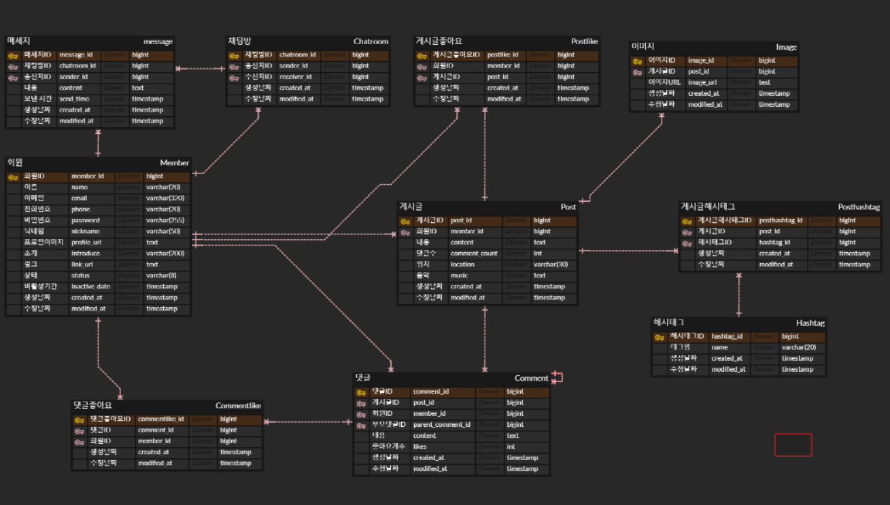
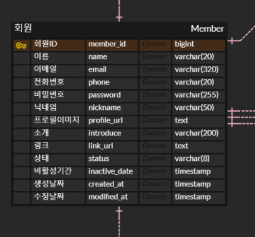
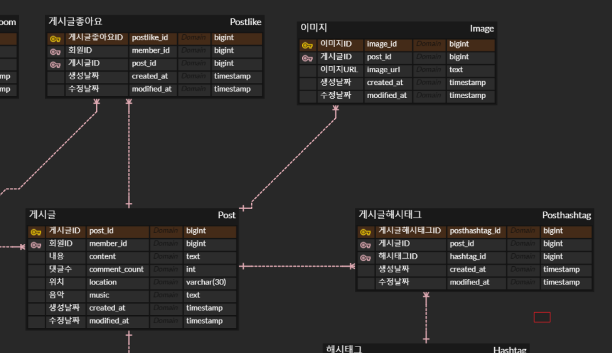
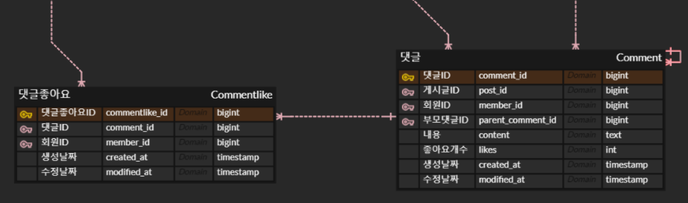
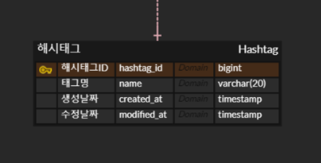
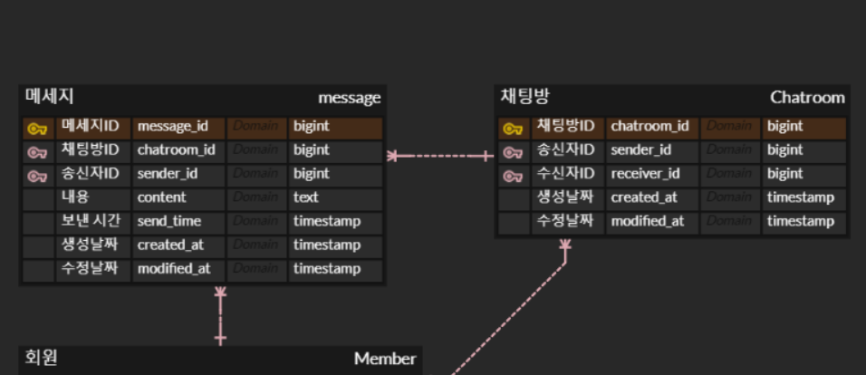

# spring-instagram-20th
CEOS 20th BE study - instagram clone coding

---

# 1-1. 도메인 및 ERD 분석


- 게시글 조회
- 게시글에 사진과 함께 글 작성하기
- 게시글에 댓글 및 대댓글 기능
- 게시글에 좋아요 기능
- 게시글, 댓글, 좋아요 삭제 기능
- 유저 간 1:1 DM 기능

총 6가지 기능에 맞추어 인스타그램 데이터 모델링을 진행해보았다. 

도메인은 총 5개 (`/member`, `/post`, `/comment`, `/hashtag`, `/chat`) 로 구성하였다. 

### 1. member


#### 회원가입
- 가입을 위해서는 휴대폰 또는 이메일 인증을 거쳐야한다.
- 인증 후에는 비밀번호, 이름, 사용자이름(닉네임)을 기입한다.

#### 마이페이지
- 마이페이지에는 프로필이미지, 이름, 사용자이름, 소개, 링크, 작성한 게시글 등이 포함된다.

#### 상태 
- 모든 회원의 상태는 `active`, `inactive` 중 하나이다. 
- 회원 탈퇴 시, `inactive` 상태로 두고 일정 기간동안 비활성인 경우 자동 탈퇴 처리가 이루어진다. 

<br />

### 2. post


#### 게시글 작성
- 게시글에는 내용, 위치, 이미지(최대 10장), 음악 등을 넣을 수 있다.

#### 게시글 조회
- 게시글은 프로필 사진, 사용자 이름, 이미지, 댓글 개수, 위치, 음악, 해시태그 등을 포함한다. 

<br />

### 3. comment


#### 댓글
- 댓글에는 내용, 좋아요 개수 등이 포함된다. 
- 댓글에는 부모 댓글을 기준으로 대댓글이 달릴 수 있다.
- 대댓글은 자신이 달린 부모 댓글의 참조 정보를 가지고 있다. 
- 모든 댓글에는 좋아요를 누를 수 있다.

<br />

### 4. hashtag


<br />

### 5. chat


#### 채팅방(디엠 리스트)
- 사용자와 또 다른 사용자 간의 디엠을 주고받는 공간이다. 

#### 메세지(디엠)
- 사용자 간 일대일로 진행되며, 실시간으로 이루어진다. 

<br />

## ✔︎ 연관관계 분석

1. 회원 - 게시글, 회원 - 메세지, 회원 - 채팅방, 회원 - 댓글좋아요, 회원 - 게시글좋아요, 회원 - 댓글  (`1:N` 일대다관계)

	: 한 명의 회원은 여러 개의 게시글 / 메세지 / 채팅방 / 댓글좋아요 / 게시글좋아요 / 댓글을 가지지만, 이들은 한 명의 회원에만 속한다.

2. 채팅방 - 메세지 (`1:N` 일대다관계)

   	: 하나의 채팅방은 여러 개의 메세지를 포함할 수 있지만, 하나의 메세지는 하나의 채팅방에만 속한다.  

4. 게시글 - 댓글, 게시글 - 게시글좋아요, 게시글 - 이미지 (`1:N` 일대다관계)

   	: 하나의 게시글은 여러 개의 댓글 / 게시글좋아요 / 이미지를 가지지만, 이들은 하나의 게시글에만 속한다. 

6. 게시글 - 게시글해시태그, 해시태그 - 게시글해시태그 (`1:N` 일대다관계)

   	- `게시글 - 해시태그` 간 연결을 위해 중간 엔티티인 게시글해시태그를 활용하였다. 

   	- 하나의 게시글은 여러 게시글해시태그를 가질 수 있고, 마찬가지로 해시태그도 여러 게시글해시태그를 가질 수 있다. 이때 게시글해시태그는 하나의 게시글과 해시태그에만 종속된다.

8. 댓글 - 댓글좋아요 (`1:N` 일대다관계)

   	: 하나의 댓글은 여러 개의 댓글좋아요를 가지지만, 하나의 댓글좋아요는 하나의 댓글에만 속한다. 

<br />

## 🤔 BaseEntity
공통 필드를 정의하여 다른 엔티티들이 공통적으로 사용할 수 있게 분리한 추상 클래스이다.
다른 엔티티들은 해당 추상 클래스를 상속받아 공통 필드를 편리하게 가져다 사용할 수 있다. 

```java
@Getter
@MappedSuperclass
@EntityListeners(AuditingEntityListener.class)
public abstract class BaseEntity {

    @CreatedDate
    @Column(name = "created_at", nullable = false, columnDefinition = "timestamp")
    private LocalDateTime createdAt;

    @LastModifiedDate
    @Column(name = "updated_at", nullable = false, columnDefinition = "timestamp")
    private LocalDateTime modifiedAt;
}
```
### ✅ @MappedSuperclass
이 클래스를 상속받는 다른 엔티티들이 공통된 필드를 가지도록 함

### ✅ @EntityListeners(AuditingEntityListener.class)
- `JPA Auditing` 기능 활성화 
- `AuditingEntityListener`는 엔티티 생성 및 수정 시점을 자동으로 기록함
- `@CreatedDate`와 `@LastModifiedDate`가 이 리스너를 통해 자동으로 관리

### ✅ @CreatedDate
- `JPA Auditing` 의 어노테이션
- 엔티티가 생성될 때 자동으로 현재 날짜와 시간으로 필드 설정

### ✅ @LastModifiedDate
- `JPA Auditing` 의 어노테이션
- 엔티티가 수정될 때 자동으로 현재 날짜와 시간으로 필드를 업데이트함

### ✅ @EnableJpaAuditing
`Springboot Application` 자체도 `JpaAuditing` 사용이 가능하도록 변경해주어야 함
```java
@SpringBootApplication
@EnableJpaAuditing
public class InstagramCloneApplication {

	public static void main(String[] args) {
		SpringApplication.run(InstagramCloneApplication.class, args);
	}

}
```

<br />

## 🤔 Builder 패턴
`Builder`를 적용하는 방식이 크게 2가지가 있음을 알게 되었다.

### 1. `@Builder`를 클래스 전체에 선언하는 방식
```java
@Entity
@Getter
@NoArgsConstructor(access = AccessLevel.PROTECTED)
@AllArgsConstructor
@Builder
public class Member extends BaseEntity {
```
- 클래스의 모든 생성자에 대해 빌더 패턴 적용 가능 
- 클래스 전체에서 동일한 방식으로 객체를 생성할 수 있어 코드의 일관성이 유지됨
- 생성자에 따라 빌더를 적용하는 데에 있어 혼동이 발생할 가능성 존재

<br />

### 2. `@Builder`를 클래스 내부 메소드로 사용하는 방식
```java
@Entity
@Getter
@NoArgsConstructor(access = AccessLevel.PROTECTED)
public class Member extends BaseEntity {
    
    (생략)
   
   @Builder
   public Member(String name, String email, String password) {
      this.name = name;
      this.email = email;
      this.password = password;
   }
}
```
- 클래스 내에서 특정 생성자에 대해서만 빌더 패턴 적용 가능
- 빌더 메서드에서 필드를 선택적으로 설정할 수 있어 더 디테일한 코드 작성 가능
- 추가적인 메서드 관리와 코드 중복을 감수해야 함

<br />

## 🤔 @Column 속성
`@Column` 어노테이션은 엔티티 클래스의 필드와 데이터베이스 테이블의 열을 매핑하는 데 사용된다. 

```java
@Column(length = 50, nullable = false)
private String nickname;

@Column(name = "created_at", nullable = false, columnDefinition = "timestamp")
private LocalDateTime createdAt;
```
### name
- 데이터베이스 열 이름 직접 지정
- 기본값은 필드명

### length
- 열의 최대 길이 설정
- `length = 50` 은 `varchar(50)`이라는 의미

### nullable
- 열이 `NULL` 값을 허용하는지에 대한 여부를 지정
- `@Column(nullable = false)`란, 해당 필드는 `NULL`값을 허용하지 않는다는 의미

### columnDefinition
- 데이터베이스 열의 SQL 데이터 유형과 속성을 직접 정의할 때 쓰임
- `text`와 `timestamp` 유형의 경우, 따로 명시해주어야 데이터베이스에 반영됨
- 예) `@Column(columnDefinition = "text")`

<br />

# 1-2. Repository 단위 테스트
```java
@SpringBootTest
@Transactional
class PostRepositoryTest {
```
### ✅ 클래스 어노테이션 정리
- `@SpringBootTest` : 애플리케이션 컨텍스트를 로드하여 통합 테스트 수행
- `@Transactional`
  - 각 테스트 메서드가 실행된 후 데이터베이스의 상태를 롤백
  - 테스트 간 데이터 간섭 방지 가능

<br />

```java
@BeforeEach
    void 기본세팅() {

        // given
        Member member = Member.builder()
                .name("이한슬")
                .email("ceos@naver.com")
                .password("1234")
                .nickname("sseuldev")
                .build();
        newMember = memberRepository.save(member);

        post1 = Post.builder()
                .content("테스트1")
                .member(newMember)
                .build();

                    (생략)

        postRepository.save(post1);
        postRepository.save(post2);
        postRepository.save(post3);
    }
```
### ✅ @BeforeEach (기본세팅)
- 각 테스트 메서드가 실행되기 전에 반드시 실행되어야 하는 코드를 지정할 때 사용
- 모든 테스트 메서드마다 반복적이고 독립적으로 실행
- 테스트 환경을 초기화하거나 공통으로 필요한 설정을 할 때 매우 유용함
- 여러 테스트에서 공통적으로 필요한 설정을 한 곳에 모아 코드의 중복을 줄여줌
- `@BeforeEach`로 선언된 메서드는 반드시 `void` 타입이어야 함!

<br />

```java
    @Test
    public void 게시물_조회_테스트() throws Exception {

        // given & when
        List<Post> posts = postRepository.findAllByMember(newMember);

        // then
        assertEquals(3, posts.size(), "게시물 개수는 총 3개입니다.");

        assertTrue(posts.stream().anyMatch(post -> post.getContent().equals("테스트1")));
        assertTrue(posts.stream().anyMatch(post -> post.getContent().equals("테스트2")));
        assertTrue(posts.stream().anyMatch(post -> post.getContent().equals("테스트3")));

        posts.forEach(post -> assertEquals(newMember.getId(), post.getMember().getId()));
    }

    @Test
    public void 게시물_삭제_테스트() throws Exception {

        // given & when
        postRepository.deleteById(post1.getId());

        // then
        List<Post> posts = postRepository.findAllByMember(newMember);

        assertEquals(2, posts.size(), "게시물 개수는 총 2개입니다.");

        Optional<Post> deletedPost = postRepository.findById(post1.getId());
        assertFalse(deletedPost.isPresent(), "삭제된 게시물이므로 존재하면 안됩니다!");
    }
```
### ✅ Assertions 정리

- assertEquals (`예상값`, `실제값`, `실패 시 출력되는 메시지`)
   : 예상 값과 실제 값을 비교하여 일치하는지 확인

- assertTrue (`조건`, `실패 시 출력되는 메시지`)
   : 주어진 조건이 참인지 확인

- assertFalse(`조건`, `실패 시 출력되는 메시지`)
  : 주어진 조건이 거짓인지 확인


<br />

<br />


# 2-1. Service 코드 구현
## 🤔 예외 처리란?
코드 내 (주로 `Service` 코드) 에서 발생하는 오류를 체계적이고 일관되게 관리하기 위해서 **예외처리구조** 를 도입한다고 한다.

예외처리구조를 위해서는 총 4가지 파일이 요구된다. 

### 1. `BadRequestException` 클래스
```java
@Getter
public class BadRequestException extends RuntimeException {

    private final int code;
    private final String message;

    public BadRequestException(final ExceptionCode exceptionCode){
        this.code = exceptionCode.getCode();
        this.message = exceptionCode.getMessage();
    }
}
```

- 잘못된 요청이 발생했을 때 사용하는 **사용자 정의 예외 클래스**로, 예외 코드와 메시지를 포함하며 `ExceptionCode`와 연동됨

### 2. `ExceptionCode` 열거형
```java
@RequiredArgsConstructor
@Getter
public enum ExceptionCode {

    INVALID_REQUEST(1000, "올바르지 않은 요청입니다."),

    // 멤버 에러
    NOT_FOUND_MEMBER_ID(1001, "요청한 ID에 해당하는 멤버가 존재하지 않습니다."),
    FAIL_TO_CREATE_NEW_MEMBER(1002, "새로운 멤버를 생성하는데 실패하였습니다."),

    // 채팅 에러
    NOT_FOUND_CHATROOM_ID(2001, "요청한 ID에 해당하는 채팅방이 존재하지 않습니다."),
    INVALID_CHATROOM(2002, "존재하지 않는 채팅방입니다."),
    VALID_CHATROOM(2003, "이미 존재하는 채팅방입니다."),

    // 게시글 에러
    NOT_FOUND_POST_ID(3001, "요청한 ID에 해당하는 게시글이 존재하지 않습니다."),
    NOT_FOUND_POST_LIKE(3002, "요청한 ID에 해당하는 게시글 좋아요가 존재하지 않습니다."),

    INTERNAL_SERVER_ERROR(9999, "서버 에러가 발생하였습니다. 관리자에게 문의해 주세요.");

    private final int code;

    private final String message;
}
```

- 다양한 예외 상황에 대한 **코드와 메시지**를 관리
- 코드와 메시지를 중앙에서 관리하기 떄문에 유지보수가 용이
- 사전에 정의된 예외 코드와 메시지를 제공하여 예외 처리를 일관성 있게 유지하게 함

### 3. `ExceptionResponse` 클래스
```java
@Getter
@RequiredArgsConstructor
public class ExceptionResponse {

    private final int code;
    private final String message;
}
```
- 클라이언트에게 반환할 **예외 응답 객체**로, 예외 코드와 메시지를 클라이언트에게 전달

### 4. `GlobalExceptionHandler` 클래스
```java
@RestControllerAdvice
@Slf4j
public class GlobalExceptionHandler extends ResponseEntityExceptionHandler {

    @Override
    protected ResponseEntity<Object> handleMethodArgumentNotValid(
            final MethodArgumentNotValidException e,
            final HttpHeaders headers,
            final HttpStatusCode status,
            final WebRequest request
    ){
        log.warn(e.getMessage(), e);

        final String errorMessage = Objects.requireNonNull(e.getBindingResult().getFieldError()).getDefaultMessage();
        return ResponseEntity.badRequest()
                .body(new ExceptionResponse(INVALID_REQUEST.getCode(), errorMessage));
    }

    @ExceptionHandler(BadRequestException.class)
    public ResponseEntity<ExceptionResponse> handleBadRequestException(final BadRequestException e){
        log.warn(e.getMessage(), e);

        return ResponseEntity.badRequest()
                .body(new ExceptionResponse(e.getCode(), e.getMessage()));
    }

    @ExceptionHandler(Exception.class)
    public ResponseEntity<ExceptionResponse> handleException(final Exception e){
        log.error(e.getMessage(), e);

        return ResponseEntity.internalServerError()
                .body(new ExceptionResponse(INTERNAL_SERVER_ERROR.getCode(), INTERNAL_SERVER_ERROR.getMessage()));
    }

}
```
- **전역 예외 처리 클래스**
- 다양한 예외를 처리하고 적절한 응답을 클라이언트에게 반환
- 예외 처리 로직과 응답 포맷팅을 중앙에서 관리하기 때문에 유지보수가 용이

### ✅ Service 코드에서는?
```java
// NOT_FOUND_MEMBER_ID(1001, "요청한 ID에 해당하는 멤버가 존재하지 않습니다."),
// NOT_FOUND_POST_ID(3001, "요청한 ID에 해당하는 게시글이 존재하지 않습니다."),

public Member findMemberById(Long memberId) {
    return memberRepository.findById(memberId).orElseThrow(() -> new BadRequestException(NOT_FOUND_MEMBER_ID));
}

public Post findPostById(Long postId) {
    return postRepository.findById(postId).orElseThrow(() -> new BadRequestException(NOT_FOUND_POST_ID));
}
```
이와 같이, 예외 발생 시 구체적인 예외 메시지와 코드가 제공되기 때문에 문제를 정확히 파악하고 처리할 수 있다!


<br />

## 🤔 DTO에서 `record` 사용해보기

### DTO에서 `record` 사용하면 좋은 이유

- `record`는 **불변 객체**를 다루기 위한 설계로, 데이터를 단순히 전달하는 **DTO**에 적합
- 자동으로 **생성자**, **getter**, `equals`, `hashCode`, `toString` 메서드를 제공
- DTO는 데이터를 캡슐화하여 전송하는 객체이므로, `record`의 간결함과 불변성이 큰 장점

### `record`의 특징

- DTO의 필드만 정의하면 해당 필드를 포함하는 **생성자**, **getter** 등이 자동으로 제공
- 필드 이름 자체가 getter 역할을 하므로 `getName()` 대신 **`name()`** 메서드를 사용
- `record`의 필드는 기본적으로 `final`처럼 동작하기 때문에 객체 생성 후 값 변경 불가
- `record` 를 선언할 때는 필요한 필드를 생성자 파라미터로 선언

> - 단순한 데이터 전송의 경우 `record` 가 적합!
> - 복잡한 로직이나 상속이 필요한 경우 `class` 가 적합!

<br />


### ✅`record`를 활용한 DTO
```java
public record PostReq(

        @NotNull
        String content,
        int commentCount,
        String location,
        String music,
        @NotNull
        List<String> imageUrls
) {
        public Post toEntity(Member member) {

                List<Image> images = this.imageUrls.stream()
                        .map(imageUrl -> Image.builder()
                                .imageUrl(imageUrl)
                                .post(Post.builder().build())
                                .build())
                        .collect(Collectors.toList());

                return Post.builder()
                        .content(this.content)
                        .commentCount(this.commentCount)
                        .location(this.location)
                        .music(this.music)
                        .member(member)
                        .images(images)
                        .build();
        }
}
```
```java
@Builder
public record ChatroomRes (
        Long chatroomId,
        Long senderId,
        Long receiverId
) {
    public static ChatroomRes of(Chatroom chatroom) {
        return ChatroomRes.builder()
                .chatroomId(chatroom.getId())
                .senderId(chatroom.getSender().getId())
                .receiverId(chatroom.getReceiver().getId())
                .build();
    }
}
```
- `of`
  - 주로 정적 팩토리 메서드로 사용되어 객체 생성을 나타냄
  - 다른 객체로부터 새로운 객체를 생성할 때 사용됨


- `toEntity`
  - DTO를 엔티티로 변환할 때 사용함
  - 변환 의도를 명확히 하고 싶을 때 사용됨


